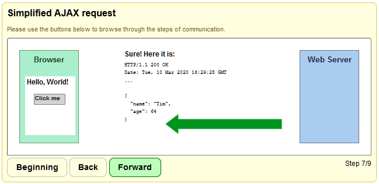
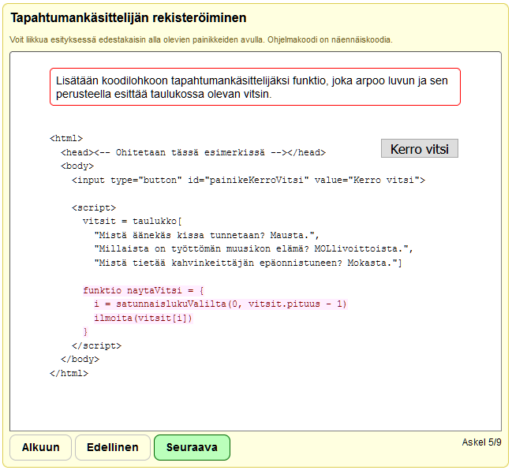

# Client–Server Messaging Visualizer

CSMV is a general-purpose client-side JavaScript library for creating visualizations of abstract concepts. These visualizations are based on steps, through which the user can browse through by pressing the buttons in the user interface. By writing a *script*, the author can compose a visualization by describing the desired steps in terms of *actors*, which are declared pieces of text, HTML, and images.

 

## Literature

CSMV has appeared in the following publications:

**Aleksi Lukkarinen, Lassi Haaranen, and Lauri Malmi. 2021.** Scripted Step-based Visualizations: A Pilot Study. In *Proceedings of the 13th International Conference on Computer Supported Education – Volume 2*, 2021, Virtual Event (CSEDU 2021), pages 240–247. SciTePress, Setúbal, Portugal. ISBN 978-989-758-502-9. ISSN 2184-5026. DOI: 10.5220/0010454502400247

**Ari Korhonen, Giacomo Mariani, Peter Sormunen, Jan-Mikael Rybicki, Aleksi Lukkarinen, Lassi Haaranen, Artturi Tilanterä, and Juha Sorva. 2021.** New Acos Content Types. In *Proceedings of SPLICE 2021 workshop CS Education Infrastructure for All III: From Ideas to Practice* at 52nd ACM Technical Symposium on Computer Science Education, March 15–16, 2021, online (SPLICE’21). 5 pages. Accessed March 27, 2021. Available at: https://cssplice.github.io/SIGCSE21/proceedings.html

 

## Visualization Examples

### Client–Server Messaging

The figure below is from a visualization of communication between a web browser and a web server.

### Registering an Event Handler

The figure below illustrates a step in a visualization that explains how to register an event handler for a Document Object Model element. The program is written in pseudocode, and both the explanations and the user interface are in Finnish.

 

## Development Setup

1. Install [node.js](https://nodejs.org/en/)
2. Install [Gulp command line utility](https://gulpjs.com/): `npm install gulp-cli -g`
3. Install [Jest](https://jestjs.io/) to use it from the command line: `npm install jest -g`
4. Clone the Git repository (e.g., `git clone https://github.com/aleksi-lukkarinen/Client-Server-Messaging-Visualizer.git`)
5. Install the project dependencies by issuing `npm install` in the root folder of the project
6. Use Gulp to build the project.
